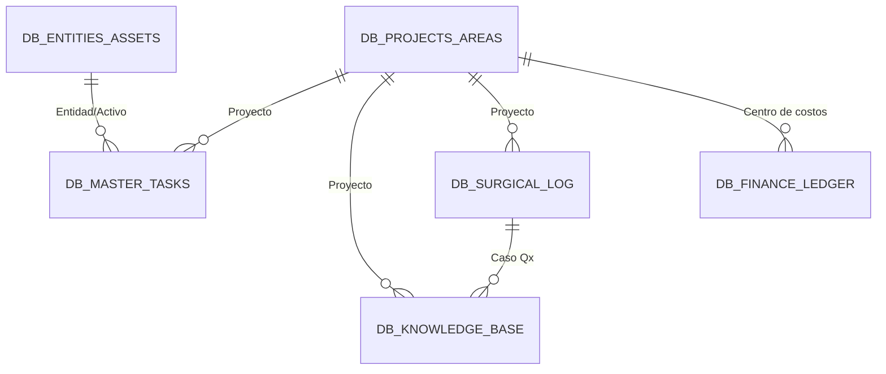

<!-- File: docs/16_ERD_MERMAID.md -->
# ERD (Mermaid) — NOs

Puedes visualizar este diagrama en cualquier visor Mermaid.

```mermaid
erDiagram
  DB_PROJECTS_AREAS ||--o{ DB_MASTER_TASKS : "Proyecto"
  DB_ENTITIES_ASSETS ||--o{ DB_MASTER_TASKS : "Entidad/Activo"
  DB_PROJECTS_AREAS ||--o{ DB_KNOWLEDGE_BASE : "Proyecto"
  DB_SURGICAL_LOG ||--o{ DB_KNOWLEDGE_BASE : "Caso Qx"
  DB_PROJECTS_AREAS ||--o{ DB_SURGICAL_LOG : "Proyecto"
  DB_PROJECTS_AREAS ||--o{ DB_FINANCE_LEDGER : "Centro de costos"
```
